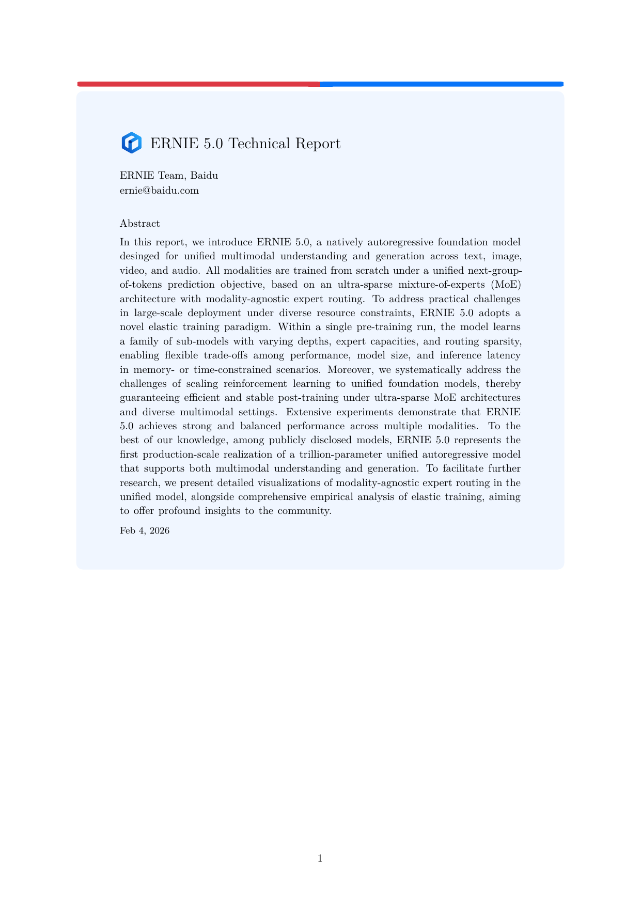
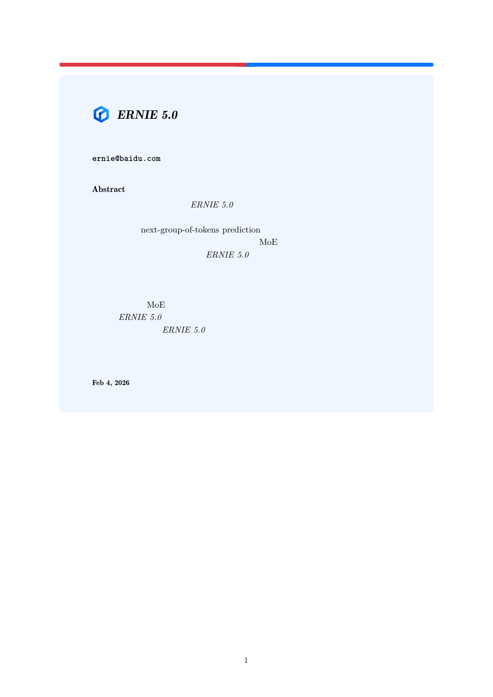
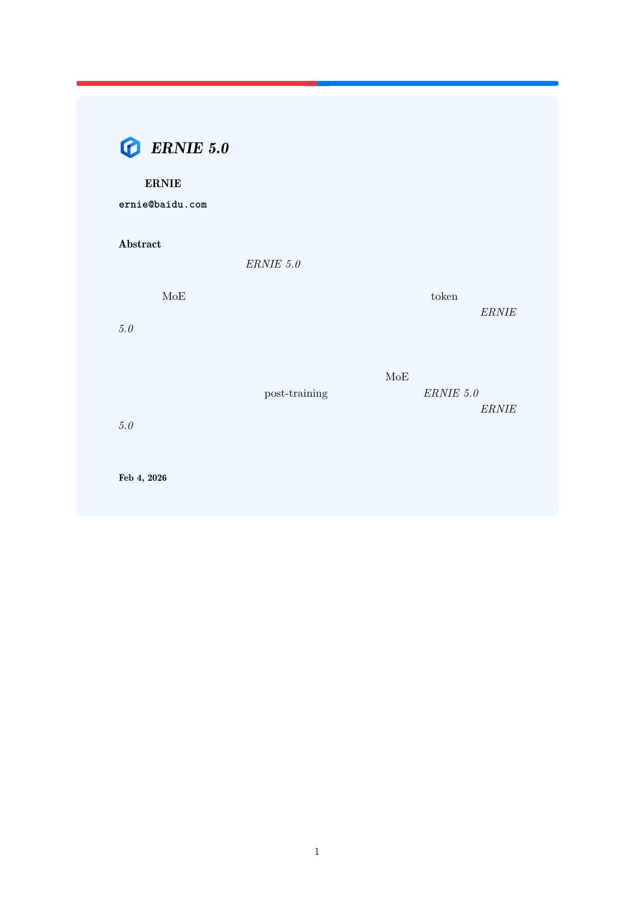

<div align="center">
  
  <h1>arXiv LaTeX Translator</h1>
</div>

<div align="center">

[](https://badge.fury.io/py/arxiv-translator)
[](https://www.python.org/downloads/)
[](https://opensource.org/licenses/Apache-2.0)
[](https://github.com/ZeyuChen/arxiv-translator/actions/workflows/ci.yml)
[](https://pepy.tech/project/arxiv-translator)

</div>

**arXiv LaTeX Translator** is a powerful tool configured to automatically translate arXiv papers from English to Chinese. It downloads the LaTeX source, translates the content using **Google Gemini 3.0** (Flash or Pro), and recompiles the paper into a professional PDF, preserving the original layout, equations, and citations.

## ✨ Features

- **Automated Workflow**: Downloads source -> Extracts -> Translates -> Recompiles.
- **Model Selection**: Choose between **Gemini 3.0 Flash** (fast/cheap) or **Gemini 3.0 Pro** (higher quality).
- **Academic Quality**: Uses specialized prompts to ensure accurate translation of AI/ML terminology and academic tone.
- **Robust Processing**:
  - Handles Large Files: Automatically chunks large LaTeX files to avoid API limits.
  - Error Resilience: Retries on network failures.
  - LaTeX Preservation: Strictly preserves mathematical formulas, citations, and structural commands.
-   **Automated Workflow**: Downloads source -> Extracts -> Translates -> Recompiles.
-   **Model Selection**: Choose between **Gemini 3.0 Flash** (fast/cheap) or **Gemini 3.0 Pro** (higher quality).
-   **Academic Quality**: Uses specialized prompts to ensure accurate translation of AI/ML terminology and academic tone.
-   **Robust Processing**:
    -   Handles Large Files: Automatically chunks large LaTeX files to avoid API limits.
    -   Error Resilience: Retries on network failures.
    -   LaTeX Preservation: Strictly preserves mathematical formulas, citations, and structural commands.
-   **DeepDive Analysis**: AI-powered technical analysis that injects explanation boxes into the PDF for complex formulas and concepts.
-   **Concurrent Processing**: Uses parallel workers (12 processes) for both translation and analysis to significantly reduce wait times.
-   **Chinese Support**: Automatically injects `ctex` package for proper Chinese rendering.

## 🚀 Installation

### Option 1: Install via PyPI (Recommended)

```bash
pip install arxiv-translator
```

### Option 2: Install from Source (For Development)

```bash
git clone https://github.com/ZeyuChen/arxiv-translator.git
cd arxiv-translator
pip install .
```

### Option 2: Development Setup (Recommended for Contributors)

```bash
git clone https://github.com/ZeyuChen/arxiv-translator.git
cd arxiv-translator

# Install micromamba environment (optional but recommended)
micromamba create -f environment.yml
micromamba activate arxiv-translator

# Install package in editable mode with dev dependencies
pip install -e .
```

### 3. Install Tectonic (TeX Engine)
The translator uses [Tectonic](https://tectonic-typesetting.github.io/) for robust PDF compilation.

```bash
# If using micromamba environment (already installed via environment.yml)
micromamba install tectonic -c conda-forge

# Or install manually
curl --proto '=https' --tlsv1.2 -fsSL https://drop-sh.fullyjustified.net | sh
```

### 4. Get Gemini API Key
1.  Visit [Google AI Studio](https://aistudio.google.com/).
2.  Sign in with your Google account.
3.  Click **"Get API key"** in the sidebar.
4.  Click **"Create API key"** (you can create it in a new or existing Google Cloud project).
5.  Copy the key string (starts with `AIza...`).

### 5. Configuration

**Quick Setup (v0.2+)**:
Run the following command to save your API key globally (stored in `~/.arxiv-translator/config.json`):
```bash
arxiv-translator --set-key YOUR_API_KEY
```

**Alternative**: Set the environment variable:
```bash
export GEMINI_API_KEY=your_api_key_here
```

## 📖 Usage

### Basic Usage
```bash
arxiv-translator https://arxiv.org/abs/2602.04705
```

### Advanced Usage

**Select Model**:
```bash
# Use Gemini 3.0 Pro (Better quality, slower)
arxiv-translator 2602.04705 --model pro

# Use Gemini 3.0 Flash (Default, faster)
arxiv-translator 2602.04705 --model flash

# Enable DeepDive Analysis (Technical Explanations)
arxiv-translator 2602.04705 --deepdive
```

**Custom Output**:
```bash
arxiv-translator 2602.04705 --output my_translated_paper.pdf
```

**Full Help**:
```bash
arxiv-translator --help
```

## 📂 Output

The translated PDF will be generated in the project root with the format:
-   `{arxiv_id}_zh_flash.pdf` (for Flash model)
-   `{arxiv_id}_zh_pro.pdf` (for Pro model)

## 🔧 Technical Details

-   **Parser**: Extracts the main LaTeX file automatically.
-   **Translator**: Uses `google-genai` SDK. Implements smart chunking for long sections.
-   **Compiler**: Uses `tectonic` for hassle-free compilation, automatically downloading necessary LaTeX packages.

## 🤝 Contributing

Contributions are welcome! Please submit a Pull Request.

## 📊 Performance Benchmark

**Test Case**: [arXiv:2602.04705](https://arxiv.org/abs/2602.04705) (ERNIE 5.0 Technical Report)

| Model | Time | Translation Quality | Note |
| :--- | :--- | :--- | :--- |
| **Gemini 3.0 Flash** | ~11 min | Good | Fast, reliable. Recommended for most papers. |
| **Gemini 3.0 Pro** | ~20 min | Excellent | Slower, higher precision in detailed academic phrasing. |

### Comparison Preview

<table>
  <tr>
    <th align="center">Original English</th>
    <th align="center">Gemini 3.0 Flash</th>
    <th align="center">Gemini 3.0 Pro</th>
  </tr>
  <tr>
    <td align="center"></td>
    <td align="center"></td>
    <td align="center"></td>
  </tr>
</table>

## 📄 License

This project is licensed under the Apache License 2.0.
